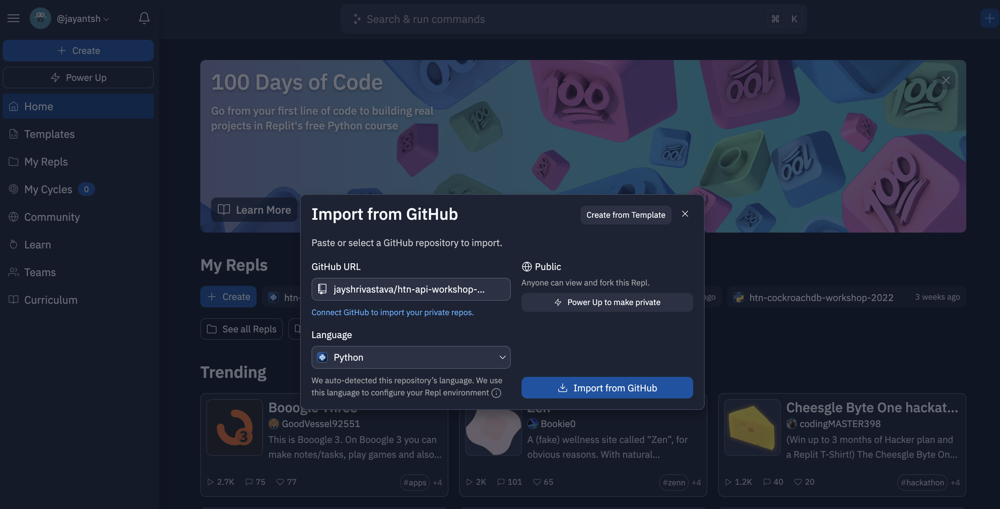

# Build a RESTful API with CockroachDB Serverless and Python

In this workshop, we’ll walk you through getting started with CockroachDB Serverless and provide an introduction to SQL and ORMs. We'll also teach you how to build a RESTful API using Python. This workshop will be hands on, and you'll leave with a working API powered by [CockroachDB Serverless](https://cockroa.ch/hackuci23)!


This guide is also published on [Notion](https://jayshrivastava.notion.site/Build-a-RESTful-API-with-CockroachDB-Serverless-and-Python-12cf27f164e74beb93102482fb21741a) (deprecated).

Learning outcomes

- setting up and using CockroachDB serverless
- importing data into a database
- using ORMs and SQL to interact with a database
- setting up and managing a Python developer environment
- using  libraries to connect to and interact with a database
- learning what RESTful APIs are and how to make them
- working with JSON data
- http protocol basics

Tech Stack

- Python, Flask
- Psycopg
- PonyORM
- CockroachDB Serverless

Requirements

- basic programming skills (functions, variables, strings, if statements, dictionaries, objects)

Source Code

[https://github.com/jayshrivastava/htn-cockroachdb-workshop-2022](https://github.com/jayshrivastava/htn-cockroachdb-workshop-2022)

- Please open Github issues if you find bugs in the code or even in this Notion page
- Feel free to ⭐ it if you liked the workshop!

Slides

[CRDB Workshop 2022](https://docs.google.com/presentation/d/1J2cWQpb0yg40C8748OC2KlsxN3CLE5WU95peLOd7rZw/edit?usp=drivesdk)

# Part 1: Introduction to CockroachDB and Serverless (2 mins)
    


    CockroachDB Serverless
    
    - Postgres Compatible Database
    - Elastic Scale
    - Consumption Based Pricing
    - Start for free. No credit card needed
    - 5GB of storage and 250M RUs per month
    - Use with your favorite language
    
# Part 2: Setup (8 mins)
    
Please do these in order.

- Replit
    1. Go to [https://replit.com](https://replit.com/login)
    2. Sign up / Log in
    3. Create a new Python repl. Click the Import from Github tab. Paste https://github.com/jayshrivastava/htn-cockroachdb-workshop-2022 and click `import`
        
        
        
    4. Install dependencies. Copy the `pyproject.toml` file and `poetry.lock` file from the source code into your repl. In the `shell` (NOT CONSOLE) run:
        
        ```bash
        poetry install
        ```
        
        **IMPORTANT:** You may sometimes encounter this error if your Replit goes to sleep.
        
        ```python
        ModuleNotFoundError: No module named 'psycopg2'
        ```
        
        You just need to run `poetry install` again to fix it.
        
        
        
- CockroachDB Serverless
    
    CockroachDB is an external database, running on different servers than our API.
    
    1. Go to [https://cockroa.ch/hackuci23](https://cockroa.ch/hackuci23), the CockroachDB Serverless page
    2. Sign up / Log in (easiest to log in with Github, Google etc)
    3. Create a Free Cluster
    4. You will be prompted to create a user and password. On the connection page, copy the **connection string** and save it as `PG_CONN_STRING` in the Replit environment variable section. If you need it again (ie. to share with your team), you can read its value from the Replit environment variable section.
        
        
        
        
        
        
        
    5. In the CockroachDB serverless tab, change `option/language` to “General connection string”. Open the `Download CA Cert` dropdown. Set the operating system to `Mac` or `Linux`. Copy the `curl` command and run it in the Replit shell.
        
        
        
        
        
        **IMPORTANT:** If you don’t work on your Replit for a while, it will go to sleep and you may get this error when working on your app
        
        ```python
        raceback (most recent call last):
            File "intro_to_psycopg2.py", line 10, in <module>
            connection = psycopg2.connect(user=user,
            File "/opt/virtualenvs/python3/lib/python3.8/site-packages/psycopg2/__init__.py", line 122, in connect
            conn = _connect(dsn, connection_factory=connection_factory, **kwasync)
        psycopg2.OperationalError: root certificate file "/home/runner/.postgresql/root.crt" does not exist
        Either provide the file or change sslmode to disable server certificate verification.
        ```
        
        Just find the command to install the certificate in the CockroachDB serverless panel and run it in Replit again.
        
    6. **Refresh your [Replit](http://Repl.it) Tab. Otherwise, environment variables may not be set.** 
    7. Run `python3 test_db_connection.py` to test that you can connect to the cluster. 
        
        
        
    
- Cockroach CLI
    
    Simply run `[cli.sh](http://cli.sh)` to use the CLI.
    
    If you can’t run it, try running `chmod +x [cli.sh](http://cli.sh/)` in the shell first.
    
    
    
# Part 3: Intro to SQL with Psycopg (10 mins)
- Psycopg
    
    Psycopg is a library used to connect to a Postgres compatible database (ie. CockroachDB).
    
    This is the boilerplate code for setting up Psycopg. You can find it in `intro_to_psycopg2.py`
    
    ```python
    import os
    import psycopg2
    
    # Create a cursor.
    pg_conn_string = os.environ["PG_CONN_STRING"]
    connection = psycopg2.connect(pg_conn_string)
    
    # Set to automatically commit each statement
    # connection.set_session(autocommit=True)
    
    cursor = connection.cursor()
    ```
    
    **Connection:** Use this to commit (”checkpoint”) your statements at the end of a transaction.
    
    **Cursor:** Use to execute statements within a transaction.
    
    **Transaction:** A series of SQL statements that you want to happen atomically. 
    
    **Super important note: Y**ou need both the connection and cursor to be able to use the library correctly. For example, this code may not work because the connection goes out of scope when the function returns.
    
    ```python
    def initialize_psycopg():
        connection = psycopg2.connect(...) 
        return cursor = connection.cursor()
    c = initialize_psycopg()
    c.select(...)
    ```
    
    Instead you should make a class and have a field referencing the connection.
    
    ```python
    class DbConnection():
        def __init__(self):
            self.connection = psycopg2.connect(...) 
            self.cursor = connection.cursor()
    
        def conn():
        return self.connection
    
        def cur():
        return self.cursor
    ```
    
    There are two main ways to interact with the database.
    
    **Querying Data**
    
    ```python
    cursor.execute("SELECT * FROM programs")
    results = cursor.fetchall() 
    # print(results)
    ```
    
    **Executing Statements**
    
    ```python
    cursor.execute("INSERT INTO programs VALUES (1, 'ece')")
    connection.commit()
    ```
    
    You must `commit()` statements for them to be saved in the database. 
    
    **Transactions**
    
    How it works is that every time you use `cursor.execute`, you aren’t actually executing something against the database and you aren’t changing the data. You can imagine that you are queueing or buffering the statements.
    
    When you `commit()` all the queued up statements are executed on your data in order  as one atomic unit. If there was any error with any of the statements, then **NONE** of the statements will have actually touched/affected your data in the database. If there were no errors (ie. success), then all of the statements will have ran against your real data in the database. 
    
    **Inserting Parameters**
    
    You can pass data in Python variables safely into SQL using Psycopg parameters. Take a look at the example below.
    
    ```bash
    def add_course_with_params():
        cursor.execute(
            "INSERT INTO courses VALUES (default, %s, %s, %s, %s)",
            ("Algorithms", "341", 2, 1)
        )
    
    def add_course_with_named_params():
        data = {
        'name': 'Programming for Performance', 
        'code': '459', 
        'program': 1,
        'credits': 1
        }
        cursor.execute("INSERT INTO courses VALUES (default, %(name)s, %(code)s, %(program)s, %(credits)s)", data)
    ```
    
    You can also filter with parameters:
    
    ```bash
    cursor.execute("SELECT * FROM courses WHERE credits > %s", (0,))
    ```
    
    **Note:** You are passing two arguments to `cursor.execute`. The first one is the SQL string and the 2nd is a tuple with parameters. Remember, if you have a single value in your tuple, add a **trailing comma**. 
    
    For more info about inserting parameters, see [https://www.psycopg.org/docs/usage.html#passing-parameters-to-sql-queries](https://www.psycopg.org/docs/usage.html#passing-parameters-to-sql-queries)
    
- SQL
    
    Take a look at `intro_to_psycopg2.py` in the examples. I will go over them during the live stream, so you can watch an explanation in the VOD.
    
    The core operations to be aware of are
    
    - CREATE TABLE
    - DROP TABLE
    - INSERT INTO
    - ALTER TABLE
    - SELECT
    - UPDATE
    - DELETE FROM
    
    There is an in depth document here ([https://www.cockroachlabs.com/docs/stable/sql-statements.html](https://www.cockroachlabs.com/docs/stable/sql-statements.html)) which you can use for reference.
    
# Part 4: Importing Data (5 mins)
    
The dataset we will use for this workshop is a list of Airbnbs in New York City! 

[https://www.kaggle.com/datasets/arianazmoudeh/airbnbopendata](https://www.kaggle.com/datasets/arianazmoudeh/airbnbopendata)

- Where to Find Data
    
    You may be wondering where to find data to use for your HTN project. I personally use Kaggle ([https://www.kaggle.com/datasets](https://www.kaggle.com/datasets)).
    
    For this workshop, we’ll show you how to import CSV data with a simple Python script. You can find these on Kaggle using the `fileType` filter ([https://www.kaggle.com/datasets?fileType=csv](https://www.kaggle.com/datasets?fileType=csv)). 
    
    Feel free to try out JSON datasets as well. We’ll be working with JSON data and JSON libraries in this workshop too.
    
- How to Move CSV Data to Replit
    1. Inspect the dataset. 
        1. The first thing to look at is the column names. See if the data points are interesting and relevant to your app. The Airbnb dataset has listing names, host names, neighborhoods, and latitude/longitude. 
            
            
            
        2. If you click on the columns tab, you can see more information about columns. For example the `A` next to `NAME` means that the column is a string column. The `key` icon next to `id`means that the column has unique (usually integer) ids and can be used as a key in our database. It also says that the `Listing Names` column has some missing values, so the listing name may be blank for some entries.
            
            
            
    
    2. Download the Data by Clicking the Download Button in the top right.
    
    
    
    1. Use the Upload File button in Replit to upload your CSV to our code directory
        
        
        
        **TIP:** If the CSV file is super large, you can trim it by taking the first 100 lines using the this command.
        
        ```bash
        sed -i '100,$ d' file.csv
        ```
        
- How to Import CSV Data to CockroachDB
    
    To create an `airbnbs` table and import data into it, I made the file `import_data.py`.
    
    The first think you want to note is the columns in the CSV. The first line in `airbnbs.csv` is pasted below. I’ve decided to use the `id`, `name`, `host`, `host_identity_verified`, `neighborhood_group`, `neighborhood`, and `construction year` columns.
    
    ```python
    # Columns
    # id,NAME,host id,host_identity_verified,host name,neighbourhood group,neighbourhood,
    # lat,long,country,country code,instant_bookable,cancellation_policy,room type,Construction year,price,service fee,minimum nights,number of reviews,last review,reviews per month,review rate number,calculated host listings count,availability 365,house_rules,license 
    
    # Rows
    # 1006859,Cute & Cozy Lower East Side 1 bdrm,1280143094,verified,Miranda,Manhattan,Chinatown,
    # 40.71344,-73.99037,United States,US,FALSE,flexible,Entire home/apt,2004,
    # $319 ,$64 ,1,160,6/9/2019,1.33,3,4,1,,
    ```
    
    In the script below, we create a table, making sure to specify the right types for certain columns. For example, `verified` is a `BOOL` column.
    
    ```python
    cursor.execute("CREATE TABLE airbnbs (id INT PRIMARY KEY, title STRING, neighbourhood_group STRING, neighbourhood STRING, host_name STRING, verified BOOL, year INT)")
    ```
    
    The last thing to do is open the file and insert each row into the database using `INSERT INTO`.
    
    ```python
    with open("airbnbs.csv", "r") as f:
        lines = f.readlines()
        
        for line in lines[1:]:
            parts = line.strip().split(',')
    
            cursor.execute(
                "INSERT INTO airbnbs VALUES (%s, %s, %s, %s, %s, %s, %s)",
                (parts[0], parts[1], parts[5], parts[6], parts[4], parts[3]
                    == "verified", parts[14]))
            connection.commit()
    ```
        
# Part 5: Using PonyORM (10 mins)

**Basics**

To explain PonyORM, I will break down the `intro_to_pony_orm.py` script.

```python
db = Database()

class Book(db.Entity):
    _table_ = 'books'
    id = PrimaryKey(int,auto=True)
    title = Required(str,unique=True)
    author = Required(str)
    rating = Required(float)
    pages = Required(int)
```

`db` is a database object. It can be used to send commands to the database. `Book` is a class which maps to a physical table called `books` in the database. We have added a unique constraint to the `title` column and declared `id`s to be automatically, uniquely assigned. Here's some examples of how it works:

- If we create new instances of `Book` (ex. `b = Book(...)`), a new row will be inserted in the database.
    
    ```python
    Book(title=title, author=author, rating=rating, pages=pages)
    ```
    
- If we want to fetch books from the database, we can call `Book.get` to get one or `[Book.select](http://book.select)` to get multiple. Use `to_dict` to convert the object to a Python dictionary.
    
    ```python
    # get one
    book = Book.get(id=id).to_dict()
    
    # select with filter
    books_query = Book.select(lambda book: book.rating >= min_rating)
    books = [book.to_dict() for book in books_query]
    ```
    
- If we want to update a book, we can read and modify the book (atomically, which I will discuss at the end of this section):
    
    ```python
    b = book.get(id = id)
    b.author = "abc"
    ```
    
- To delete a book, we get it and delete it (atomically)
    
    ```python
    b = book.get(id = id)
    b.delete()
    ```
    

This idea of manipulating objects to manipulate data in a relational database is called "Object-relational-mapping", which is what ORM stands for.

The next section initializes the `db` object (and the `Book` class which uses `db.Entity`). It creates tables in the database if they do not exist.

```python
pg_conn_string = os.environ["PG_CONN_STRING"]
db = Database() 
db.bind('postgres', pg_conn_string) # Bind Database object to the real database
db.generate_mapping(create_tables=True) # Create tables if they do not exist
```

**Transactions**

The purpose of the `@db_session` decorator is to tell SQLite that the code in that function needs to be atomic. Generally, every time I use the`Book` class, I put the logic in a single function and put  `@db_session`  above the function. 

How it works is that every line in the function, when executed, is “queued” or “buffered”. When the function ends, then all the operations get committed atomically in the database. If there was any error during the function, then none of the lines will have executed on the database.

# Part 6: Intro to REST APIs (5 mins)
- 3-Layered Architecture
    
    Modern applications (at least the simple ones) follow the 3-layered architecture: client, server, database. Typically, a company or organization hosts their own servers and databases and provides users with some way to download their client applications. For example, you download Instagram on your phone from the app store. That client application talks to Instagram's servers which grab images from Instagram's databases for you to see. 
    
- APIs and URLs
    
    API: Application Programming Interface
    
    An API essentially defines a set of functions and rules for interacting with a server. Building an API means implementing these functions and making them available for clients to use. APIs can be private/secure (ie. require a login or a specific client) or be public.
    
    URL: Universal Resource Identifier
    
    You’ve seen URLs every time you visit a site. The URL uniquely identifies that site. Similarly, APIs have a unique address. They can also have subdirectories (aka **routes)** to organize different resources. You may even pass parameters like function arguments. For example, when you do a Google search for phones, you are directed to this URL: [https://www.google.com/search?q=phones](https://www.google.com/search?q=phones), which takes the argument `q` which stands for “search query”. You can also pass arguments by position instead of name, like `exampleurl.com/books/1`, which passes the value `1`. You may see the term **endpoint** or **URI**, which are basically the same thing as URLs. 
    
- HTTP Status Codes
    
    Hypertext Transfer Protocol
    
    This is a protocol that describes how requests can be sent to a server. It has 4 main **methods: GET, POST, PUT, and DELETE** which define the effect a request should have.
    
    - GET requests fetch data
    - POST requests create a new item
    - PUT requests update an item
    - DELETE requests delete an item
    
    Say we have an endpoint `[GET] https://my-domain.api.com/books/1`. This implies that a request to this endpoint will return the book with the `ID=1`. If the endpoint accepted `[DELETE]` requests, we infer that sending a request would delete the book with `ID=1`.
    
    There are also rules about how we can use these APIs. The important ones being:
    
    - **Safety:** A method is safe if it does not modify a resource on the server side
    - **Idempotency:** A method is idempotent if repeated requests will produce the same result
    
    Why do these matter? One reason is **retries.** Browsers commonly retry requests if they fail, but they may not if an endpoint is not safe or not idempotent. They are also useful for informing client/frontend developers on your team on how to use your API properly.
    
    Here is a summary of HTTP rules:
    
    
    
    Another important element of HTTP is status codes. These are 3 digit codes that indicate the outcome of sending an HTTP request. For example, 404 is the code for “not found”, and 200 is the code for “success”. These are important for letting clients know the outcomes of their requests so they can act accordingly.
    
    
    
    For more info about status codes, see [https://developer.mozilla.org/en-US/docs/Web/HTTP/Status](https://developer.mozilla.org/en-US/docs/Web/HTTP/Status).
    
- REST
    
    Representational State Transfer
    
    REST is a collection of 6 princples that govern good API design. They are
    
    - uniform interface
    - stateless
    - cacheable
    - client-server
    - layered system
    - code on demand
    
    These are outside the scope of this workshop, but are widely used in the tech industry. A good place to learn about them is here: [https://restfulapi.net](https://restfulapi.net/)
        
# Part 7: Making a REST API with Flask and Psycopg (15 mins)
- Launching a Flask API
    
    Insert the following code into `main.py`. 
    
    ```python
    # Import the Flask library + some others we will use later
    from flask import Flask, jsonify, request
    
    # Create a Flask object.
    app = Flask(__name__)
    
    # Create our first route which returns the string "hello". 
    @app.route('/', methods=['GET'])
    def index():
        return "hello"
    
    # Runs the API and exposes it on https://<repl name>.<replit username>.repl.co
    # ex. Mine deploys to the URL https://htn-api.jayantsh.repl.co.
    app.run(
        host = "0.0.0.0",
        debug = True
    ) 
    ```
    
    Upon running this snippet, [Repl.it](http://repl.it) recognizes that we are launching an API, so it exposes it to the public. You should see a window pop up that sends an HTTP GET request to your main URL. In the code, we set up a handler function called `index()`, which is handling this.
    
    
    
- Writing our endpoints
    - Small Notes about `RealDictCursor` and `autocommit=True`
        
        **RealDictCursor**
        
        ```python
        cursor = connection.cursor(cursor_factory=psycopg2.extras.RealDictCursor)
        ```
        
        This makes the `cursor.fetchX` methods return Python dictionaries which can be accessed easily. For example:
        
        ```python
        courses = cursor.execute("SELECT * FROM courses")
        results = cursor.fetchall() # returns 
        # [
        # {"program": "ECE", "code": 252 ...},
        # {"program": "CS", "code": 250 ...}
        # ]
        print(results[0]['code'] # 252
        ```
        
        Otherwise, `fetchall` returns tuples, which are more confusing to use because you have to remember what index of the tuple to read:
        
        ```python
        courses = cursor.execute("SELECT * FROM courses")
        results = cursor.fetchall() # returns 
        # [
        # ("ECE", 252 ...),
        # ("CS", 250)
        # ]
        print(results[0][1] # 252
        ```
        
        **Autocommit = True**
        
        ```python
        connection.set_session(autocommit=True)
        ```
        
        Setting `autocommit` means that each call to `cursor.execute()` will immediately show up in the database, and you won’t need to call `connection.commit()`. It also means that subsequent statements cannot be made atomic:
        
        ```python
        cursor.execute("INSERT INTO foo (a,b,c) VALUES (1, 2, 3)")
        ... some python code ...
        cursor.execute("SELECT * FROM foo where a = 1 AND b = 2 and C = 3")
        result = cursor.fetchall() # []
        ```
        
        Why might the last line return an empty array?
        The answer is that these two operations were committed to the database individually. It's possible that someone used your API in between the two `cursor.execute()` statements and deleted the record before you had a chance to read it.
        
        How to solve this? Just set it to `False` temporarily.
        
        ```python
        connection.set_session(autocommit=False)
        
        cursor.execute("INSERT INTO foo (a,b,c) VALUES (1, 2, 3)")
        ... some python code ...
        cursor.execute("SELECT * FROM foo where a = 1 AND b = 2 and C = 3")
        result = cursor.fetchall() # [{"a": 1, "b": 2, "c": 3}]
        
        connection.commit()
        connection.set_session(autocommit=True) # REMEMBER to set 
        # it back to true for future use
        ```
        
        Or just try to do things using one SQL statement :) 
        
    - GET Routes
        
        First, we implement the `index` route which returns all airbnbs:
        
        ```python
        def db_get_all():
            cursor.execute('SELECT * FROM airbnbs')
            results = cursor.fetchall()
            return results
        
        @app.route('/', methods=['GET'])
        def index():
            return jsonify(db_get_all())
        ```
        
        This code simply selects all books and returns them in a Python list. Then, it encodes them as a JSON string and returns them as the response to the GET request.
        
        Next, we implement the `get_by_id` route:
        
        ```python
        def db_get_by_id(id):
            cursor.execute('SELECT * FROM airbnbs WHERE id = %s', (id, ))
            result = cursor.fetchone()
            return result
        
        @app.route("/<id>", methods=['GET'])
        def get_by_id(id):
            airbnb = db_get_by_id(id)
            if not airbnb:
                return jsonify({"error": "invalid id", "code": 404})
            return jsonify(airbnb)
        ```
        
        Here, we query for an airbnb with the given id. If `db_get_by_id` returns an empty array, it means there is no airbnb with the given id. Thus, we can return an error object with a code 404, which means “not found”. Note how the route parameter `id` is defined as `"/<id>"` and is passed in as a parameter to `get_by_id`
        
        Finally, we can update the search function:
        
        ```python
        def db_filter_listings(min_year, group):
            cursor.execute(
                'SELECT * FROM airbnbs WHERE neighbourhood_group = %s AND'+
                'year >= %s',
            (group, min_year))
            result = cursor.fetchall()
            return result
        
        @app.route("/search", methods=['GET'])
        def filter_listings():
            min_year = request.args.get('min_year')
            if min_year is None:
                min_year = 0
            else:
                min_year = int(min_year)
                
            result = db_filter_listings(min_year, request.args.get('group'))
            return jsonify(result)
        ```
        
        Query parameters are passed in to the `request.args` dictionary. They are stored as strings so they need to be converted to the type you expect them to be.
        
        Also note that if a user does not one of the query parameters, it will have the value `None`. You may need to add extra code to handle those cases.
        
        **Testing**
        
        With the API running, you can open the Replit shell and use `python3 get_request.py` to test all these routes (remember to update the URL to the URL of your Replit project). The code below is from `get_request.py` and shows how to use route parameters, use query parameters, and decode JSON.
        
        Note that `response.json()` returns a Python object which you can manipulate in code. `json.dumps()` will encode the object to a string. Specifying `indent=2` makes it print nicely.
        
        ```python
        # Get all the listings
        response = requests.get('https://htn-cockroachdb-workshop-2022.jayantsh.repl.co')
        print(json.dumps(response.json(), indent=2))
        
        # Get one listing using route parameter
        response = requests.get('https://htn-cockroachdb-workshop-2022.jayantsh.repl.co/1004098')
        print(json.dumps(response.json(), indent=2))
        
        # Search with query parameters
        response = requests.get('https://htn-cockroachdb-workshop-2022.jayantsh.repl.co/search?group=Manhattan')
        print(json.dumps(response.json(), indent=2))
        ```
        
    - POST Route
        
        To create a new airbnb, we use an SQL `INSERT INTO` statement. At the end of the statement, I added a `RETURNING id` so we can get the `id` of the newly inserted airbnb.
        
        ```python
        def db_create_airbnb(title, name, neighbourhood, neighbourhood_group, verified, year):
            connection.set_session(autocommit=False)
            cursor.execute(
                "INSERT INTO airbnbs (title, host_name, neighbourhood,"+ 
                "neighbourhood_group, verified, year) VALUES" +
                "(%s, %s, %s, %s, %s, %s) RETURNING id",
                (title, name, neighbourhood, neighbourhood_group, 
                    verified, year))
            result = cursor.fetchall()
            return result
        
        @app.route("/", methods=['POST'])
        def create_airbnb():
            new_airbnb = request.json
            try:
                res = db_create_airbnb(new_airbnb['title'],
                        new_airbnb['name'],
                        new_airbnb['neighbourhood'],
                        new_airbnb['neighbourhood_group'],
                        new_airbnb['verified'], new_airbnb['year'])
                return jsonify(res)
        
            except Exception as e:
                return jsonify({"error": str(e)})
        ```
        
        This time, we will pass data to be saved in the database through the request body as JSON data. This can be accessed from the `request.json` dictionary.
        
        If there is an error, such as a missing field from the json dictionary, we will catch the error and return it as JSON.
        
        **Testing**
        
        Running `python3 post_request.py` will send a sample POST request (remember to update the URL to the URL of your Replit project). By passing the `json` named parameter to `[request.post](http://request.post)` , you can pass a dictionary in the request body as JSON.
        
        ```python
        new_airbnb = {
            'title': 'Nice Studio by the Water',
            'name': 'Jay',
            'neighbourhood': 'Brooklyn',
            'neighbourhood_group': 'Williamsburg',
            'verified': True, 
            'year': 2002
        }
        
        response = requests.post(
            'https://htn-cockroachdb-workshop-2022.jayantsh.repl.co',
            json = new_airbnb
        )
        
        print(json.dumps(response.json(), indent=2))
        ```
        
    - PUT and DELETE Routes TODO
        
        PUT and DELETE requests are implemented using the SQL `UPDATE` and `DELETE` commands respectively. Both use `RETURNING id` to return the id of the affected row. If multiple rows are affected, then multiple rows will be returned.
        
        In both handlers, I wrap the `db_` function in a `try/except` and return any error that arises.
        
        ```python
        def db_update_title(id, new_title):
            cursor.execute("UPDATE airbnbs SET title = %s WHERE id = %s"+ 
                            "RETURNING id",
                            (new_title, id))
            result = cursor.fetchall()
            return result
        
        def db_delete_listing(id):
            cursor.execute("DELETE FROM airbnbs WHERE id = %s RETURNING id",
                (id, ))
            result = cursor.fetchall()
            return result
        
        @app.route("/<id>", methods=['PUT'])
        def update_title(id):
            try:
                title = request.json['title']
                return jsonify(db_update_title(id, title))
            except Exception as e:
                return jsonify({"error": str(e)})
        
        @app.route("/<id>", methods=['DELETE'])
        def delete_book(id):
            try:
                return jsonify(db_delete_listing(id))
            except Exception as e:
                return jsonify({"error": str(e)})
        ```
        
        **Testing**
        
        You can use `python3 put_request.py` and `python3 delete_request.py` to test these endpoints. PUT combines both route parameters and passing data in the request body.
        
        ```python
        new_data = {
            'title': 'Small Cozy 1 Bedroom Apartment In Midtown West'
        }
        
        response = requests.put(
            'https://htn-cockroachdb-workshop-2022.jayantsh.repl.co/1004098',
            json = new_data)
        
        print(json.dumps(response.json(), indent=2))
        ```
        
        ```python
        response = requests.delete(
            'https://htn-cockroachdb-workshop-2022.jayantsh.repl.co/1004098')
        
        print(json.dumps(response.json(), indent=2))
        
        ```
        

### Additional Resources

Psycopg Reference: [https://www.psycopg.org/docs/usage.html](https://www.psycopg.org/docs/usage.html)

PonyORM Reference: [https://docs.ponyorm.org/queries.html](https://docs.ponyorm.org/queries.html)

SQL Syntax: [https://www.cockroachlabs.com/docs/stable/sql-statements.html](https://www.cockroachlabs.com/docs/stable/sql-statements.html)

Poetry Package Manager: [https://python-poetry.org/docs/cli/](https://python-poetry.org/docs/cli/)

HTTP Method Rules: [https://developer.mozilla.org/en-US/docs/Web/HTTP/Methods](https://developer.mozilla.org/en-US/docs/Web/HTTP/Methods)

HTTP Status Codes: [https://developer.mozilla.org/en-US/docs/Web/HTTP/Status](https://developer.mozilla.org/en-US/docs/Web/HTTP/Status)

REST: [https://restfulapi.net](https://restfulapi.net/) 
 